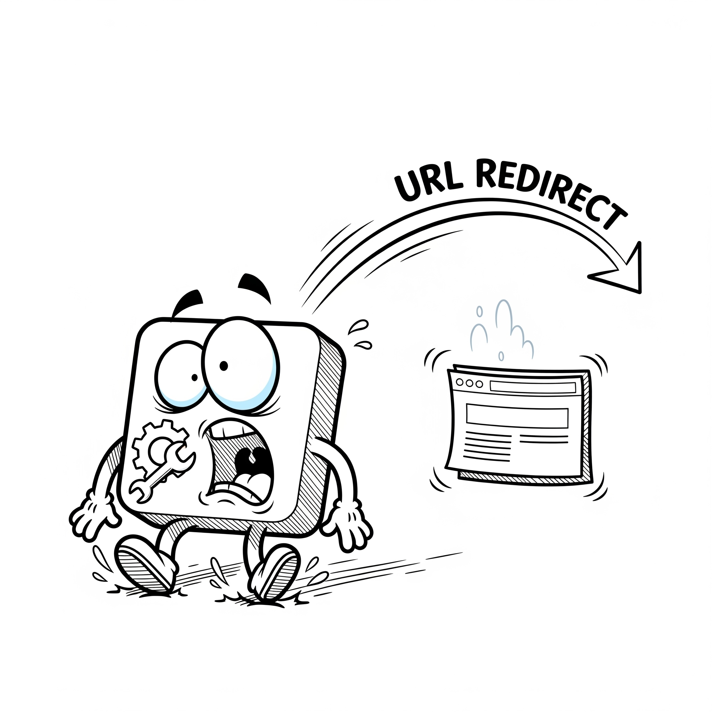

# URL Redirector

This Chrome extension allows you to redirect URLs based on user-defined rules. You can create rules using regular expressions to match source URLs and specify the destination URL for redirection.

## How to Install

1.  **Download or clone this repository.**
2.  Open Google Chrome and navigate to `chrome://extensions/`.
3.  Enable **"Developer mode"** using the toggle switch in the top-right corner.
4.  Click on the **"Load unpacked"** button that appears.
5.  Select the directory where you downloaded or cloned this repository.

The extension should now be loaded and active.

## How to Use

1.  **Click the extension icon** in the Chrome toolbar to open the URL Redirector management page.
2.  **Add a new rule:**
    *   Enter a regular expression for the "Source URL" you want to redirect.
    *   Enter the "Destination URL" where you want to be redirected.
    *   Click **"Save Rule"**.
3.  **Manage your rules:**
    *   The table shows all your configured rules.
    *   You can **enable or disable** a rule using the toggle switch.
    *   You can **edit** the source or destination URLs directly in the table.
    *   You can **delete** a rule by clicking the "X" button.
4.  **Update all rules:**
    *   After making changes in the table (editing, enabling/disabling), click the **"Update All Rules"** button to save your changes.